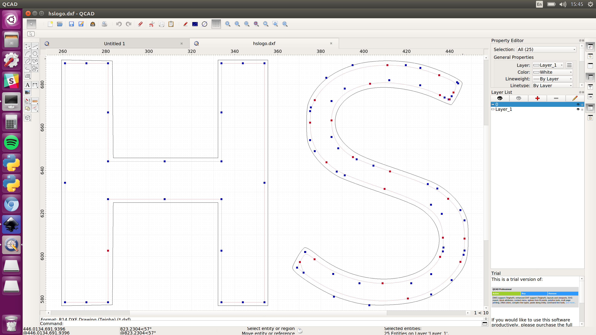

# Picking your design

To design the stencil, you’ll need a 2D CAD (computer-aided-design) software package. Two of the most popular available are, Inkscape and QCAD (both free downloads), which is what we’ll be using in this tutorial – though the principles are much the same for any software. 
If you want to make a stencil from an existing image, you need to generate paths from the image, and Inkscape is usually the best bet for that. Black and white files generally tend to work better for tracing. You’ll need to import the image, and then use the Path > Trace Bitmap > Edge Detection command to trace the image’s outline. Play around with the threshold setting until the preview shows you something you’re happy with, (normally, you want to get the threshold as high as possible for a clearer set of paths). Click OK, and then delete the original image from behind the newly-created paths. Once you’ve done this, you might end up with double lines (a quirk of the way Inkscape traces outlines), so zoom in and delete anything you don’t want cut, (it can be easier to do this stage in QCAD, as the individual paths are easier to see when they aren’t filled in). 
If you’re designing something custom to cut, QCAD may be easier, especially if you’re not well-versed in graphics software. Draw out the design you want with the tools on the left-hand side of the window, (again bearing in mind that anything inside the outermost line won’t show up – use stencil fonts to help with this). 

When you’ve got a design you’re happy with, draw an outline as big as you want the stencil. Position the image in the middle, leaving about 25mm safety margin around the actual image (you’ll need to hold/support it when applying). Save it as a DXF file, (or whatever your laser-cutter software accepts). 
You’ll need to import the design into your laser-cutter software, and select an appropriate cutting speed and power. We successfully cut our X mm Mylar at about 50% power and 100 mm s-1 on a 30 W cutter. Position your design, and get cutting. 

After your design is finished, the next step is to wash it thoroughly, if you’re applying it directly to food. Wash it with hot water and washing up liquid several times, (not with a dishwasher though – it’s likely to do funny things to the plastic). 

