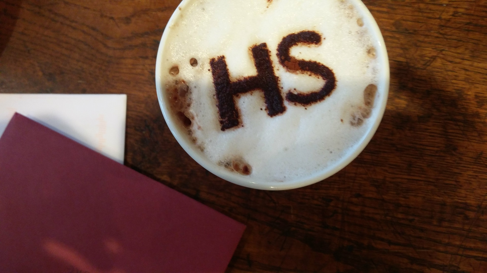

## Stenciling the food

Now all that remains is to use the stencil. If you’re painting, lay your stencil so it is as flush to the food's surface as possible. You might want to use some small weights to keep the stencil pressed down. Use a food paintbrush (available in any cooking shop) to paint through some adhesive — golden syrup, warm glucose syrup, honey, or sieved jam work well. Then, remove your stencil and sprinkle on whatever you want to stick to the food. Let the adhesive dry for ten minutes, and gently touch up any problem areas. 

If you’re sprinkling powder directly on to your food, hold the stencil as low as possible without touching the surface for a clearer image. Sprinkle fine powders through a sieve to get even distribution. And that’s it! Go wild with designs, see what works, and what doesn’t, and play around!

This tutorial first appeared in HackSpace magazine issue 3, which you can download for free from [hsmag.cc](https://hsmag.cc){:target="_blank"}. Follow HackSpace magazine to get your fill of making every month.

